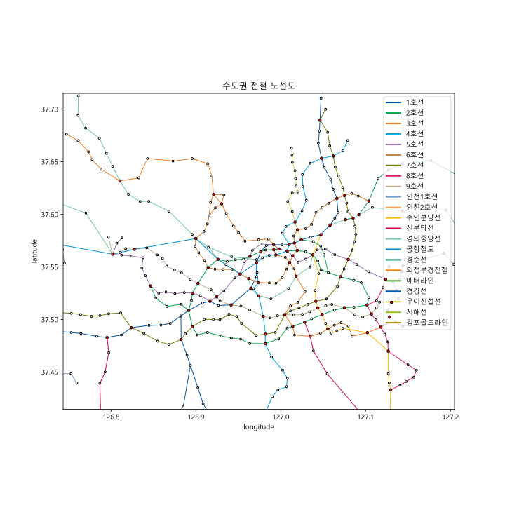

# SeoulMetropolitanSubway

수도권 전철 노선도를 그래프화하고 이를 경위도 상으로 도시하는 Python 프로젝트입니다.

## 프로젝트 구현 방법

[서울시 열린데이터 광장](https://data.seoul.go.kr/), [공공데이터포털](https://www.data.go.kr/) 등의 데이터 수집 사이트에 있는 지하철 노선에 대한 데이터는 대다수 운영 기관에 따라 자료가 분리되어 있는 등 편재화된 데이터의 분포를 보여줍니다. 따라서 수도권 전철 노선도 전체에 대한 정보를 수집하기에는 어렵다고 판단, API가 아닌 직접 [서울교통공사 사이버스테이션](http://www.seoulmetro.co.kr/kr/cyberStation.do)에서 자료를 크롤링하여 그래프를 만들었습니다.

1. 서울교통공사 사이버스테이션 자료 수집: [Selenium](https://www.selenium.dev/)을 이용하여 HTML 다운로드, 역 목록 및 정보(ID, 역명, 연계 노선 번호), 역간 연결, 노선번호-노선명 관계 파악
2. 카카오 로컬 API를 이용하여 각 역별 경위도 수집
3. 정보를 바탕으로 [NetworkX](https://networkx.org/documentation/stable/tutorial.html)를 이용하여 그래프 생성

만든 그래프를 바탕으로 이를 경위도 좌표계에 도시하였습니다. 동명의 다른 노선에 속한 역들은 각각이 완전 그래프의 형태로 연결되어 있기 때문에, 그 간선들을 삭제하고 하나의 역으로 통합하였습니다. 주어진 노선의 대표 색을 바탕으로 간선을 그리고, 환승역과 비환승역 정점을 다른 색으로 구분하였습니다.

 

## 사용한 라이브러리 및 필요 권한

- [Selenium](https://selenium-python.readthedocs.io/)
- [lxml](https://lxml.de/)
- [NetworkX](https://networkx.org/documentation/stable/tutorial.html)
- [pandas](https://pandas.pydata.org/), [fastparquet](https://pypi.org/project/fastparquet/)
- [Matplotlib](https://matplotlib.org/)
- 노선 자료에 대한 모든 권한은 서울교통공사에 있습니다.
- 역의 경위도를 불러오기 위해서는 [카카오 로컬](https://developers.kakao.com/docs/latest/ko/local/dev-guide)의 Rest API Key가 필요합니다.
- 그래프를 그리는데 사용한 자료는 [대한민국 최신 행정구역(SHP) 다운로드 – GIS Developer](http://www.gisdeveloper.co.kr/?p=2332)를 참조하였으며, [GeoPandas](https://geopandas.org/)를 이용하였습니다. CTPRVN, SIG 모두 [mapshaper](https://mapshaper.org/)를 이용해 좌표계를 WGS84(epsg: 4326)으로 변경하였으며 1%로 폴리곤 단순화하였습니다. SIG는 서울, 경기, 인천 지역만을 추출하였습니다.

## 그래프 설명

1. 정점(node): 역을 나타냅니다.

   `station_id`: 정점 접근 key, `str`

   `g_modified`에서 통합된 동명의 환승역의 `station_id`는 통합 이전 환승역들의 `station_id`를 오름차순으로 정리한 뒤 공백을 사이로 연결함

   정점 attributes

   - `line_no`: 역에 연계된 노선의 번호, `str`

     `line_no`-`line_name` 테이블

     |     1      |    2     |     3      |    4     |   5    |      6       |    7     |   8    |     9      |     I     |      I2      |
     | :--------: | :------: | :--------: | :------: | :----: | :----------: | :------: | :----: | :--------: | :-------: | :----------: |
     |   1호선    |  2호선   |   3호선    |  4호선   | 5호선  |    6호선     |  7호선   | 8호선  |   9호선    | 인천1호선 |  인천2호선   |
     |     B      |    S     |     K      |    A     |   G    |      U       |    E     |   KK   |     W      |    SH     |      KP      |
     | 수인분당선 | 신분당선 | 경의중앙선 | 공항철도 | 경춘선 | 의정부경전철 | 에버라인 | 경강선 | 우이신설선 |  서해선   | 김포골드라인 |

   - `station_name`: 역명, `str`

   - `is_interchange`: 환승역 여부, `bool`

   - `x`: 경도, `float`

   - `y`: 위도, `float`

2. 간선(edge): 역간 연결을 나타냅니다.

   간선 attributes

   - `line_no`: 간선이 나타내는 노선

     동명의 환승역 간 `line_no`는 `''`임

     `g_modified`에서 통합된 간선의  `line_no`는 통합 이전 간선의 `line_no`를 오름차순으로 정리한 뒤 공백을 사이로 연결함

## 파일 설명

- README.md
- source
  - create_graph.ipynb: 노선도 그래프를 만드는 Jupyter Notebook
  - draw_gray.ipynb: 그래프를 matplotlib를 이용하여 도시하는 Jupyter Notebook
  - multiprocessing_worker.py: get_coord_by_keyword를 포함한 병렬 처리를 처리하기 위한 모듈
- data
  - input
    - CTPRVN: 대한민국 시도 행정구역 경계도, 폴리곤 단순화 1%, WGS84, UTF-8
    - SIG: 수도권(서울, 경기, 인천) 시군구 행정구역 경계도, 폴리곤 단순화 1%, WGS84, UTF-8
  - output
    - interchange_list.json: 환승역 리스트
    - line_no_table.parquet: 노선 번호와 관계된 정보에 대한 딕셔너리를 테이블화한 것
    - metro_graph.gml: 그래프 파일
    - station_id_table.parquet: 역 ID와 관계된 정보에 대한 딕셔너리를 테이블화한 것
    - view_all.svg, view_all_with_boundary.svg, view_seoul.svg, view_seoul_with_boundary.svg: 그래프를 도시한 것

## 기여가 필요합니다

- 노선의 색상을 자동으로 추출하는 기능
- 정점, 간선별 정보 추가(승하차량, 노선별 배차간격, 시간 등): 교통 네트워크 분석에 용이하게 사용할 수 있습니다.
- 현재 4호선·수인분당선 한대앞역~오이도역 전 구간, 6호선·경의중앙선 공덕~효창공원 구간에서의 복선 도시가 이루어지지 않았습니다(20201222). Matplotlib의 관련 기능이나 방법을 아는 분의 기여가 필요합니다.
- 기타 다양한 아이디어와 기능 추가 환영합니다.